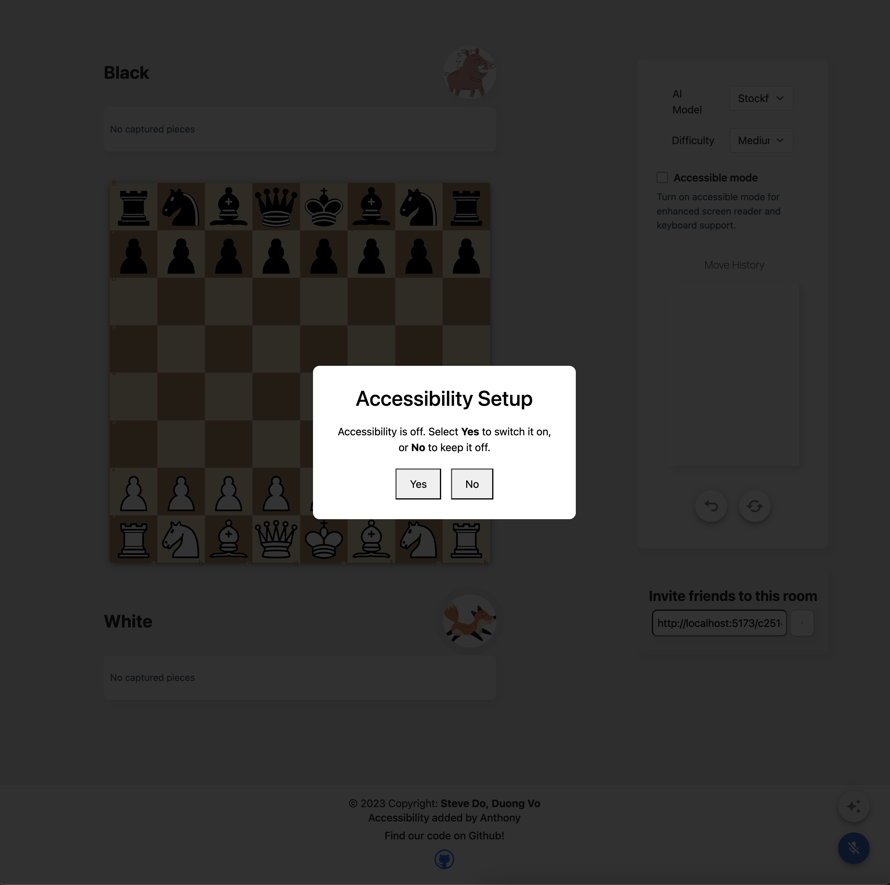
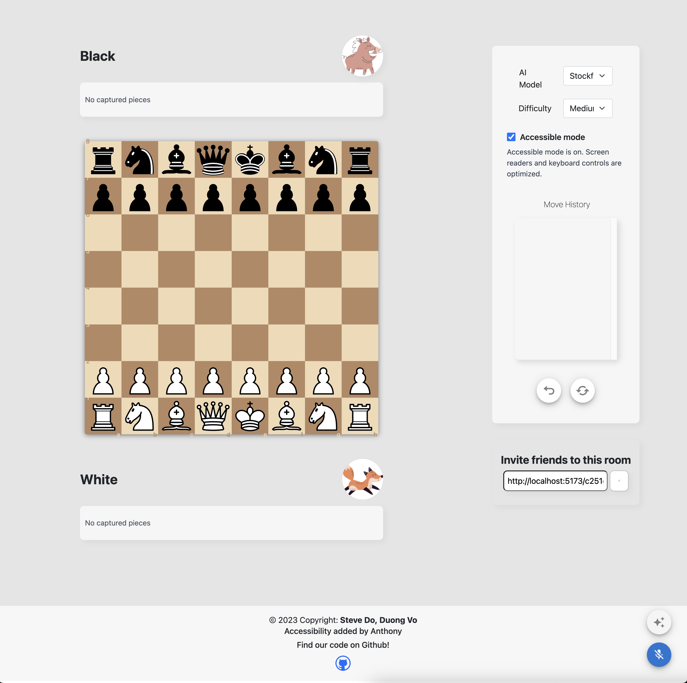
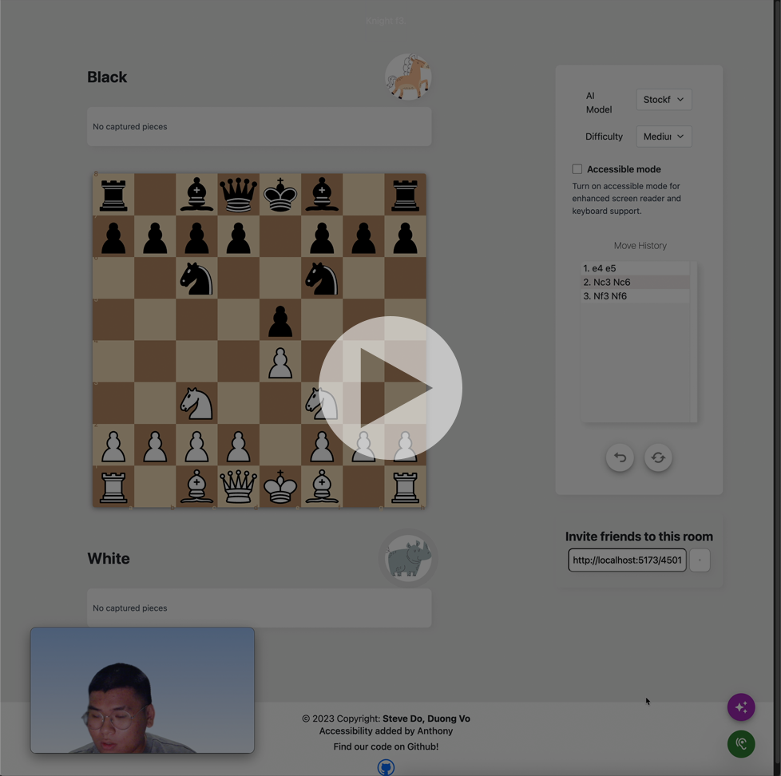

# ChessLand: Accessibility and AI Voice Revamp

This project is a fork from [ChessLand](https://github.com/dominhnhut01/chessgame_webapp). 

## Mission

The primary mission of this project is to create a fully accessible and hands-free chess experience. By combining rigorous accessibility standards with a highly accurate AI voice recognition system, this application ensures that visually impaired users or those requiring hands-free controls can seamlessly navigate and play the game.

## Accessibility Features

To achieve comprehensive accessibility and WRAI compliance, the interface has been completely restructured:

* **Initial Setup Prompt:** Upon launching the application, users are greeted with a fully accessible dialog prompt asking if they wish to enable voice mode and accessibility features. This choice is saved locally to respect user preferences.
* **Revamped Board Wrapper:** The standard chessboard has been overlaid with a mathematically accurate, visually hidden HTML grid.
* **Easy Navigation:** Users can navigate the entire application using standard keyboard controls. The `Tab` key seamlessly moves focus between control components, while the `Arrow` keys allow users to explore individual squares on the chessboard to check piece positions and execute moves.

## AI Voice Control: The Hybrid Engine

The application features a smart voice detection system powered by a dual-engine approach to balance speed and accuracy.

### Native WebSpeech
For instantaneous recognition, the app utilizes the browser's native WebSpeech API. While this engine provides near-zero latency, it is primarily limited to Google Chrome and often struggles with the specific formatting of standard algebraic chess notation (e.g., "Knight to f3"). 

### OpenAI Whisper API Integration
To overcome the inaccuracies of native recognition, this project implements a specialized pipeline using the OpenAI Whisper API.

**How it works:**
The recording system captures microphone input and continuously divides the audio stream into optimized 250ms audio blobs. By separating the ongoing audio recording process from the actual transcription request, the system minimizes latency. Once the user stops speaking, the combined audio blob is immediately processed by the local backend and sent to Whisper. 

This architecture provides the high-precision transcription required for complex chess moves, bridging the gap where the fast-but-inaccurate WebSpeech engine fails.

## Project Demo

### Interface Previews
**First-Time Accessibility Prompt:**

**New Application UI:**

### Video Demonstration
Click the thumbnail below to watch the full video demonstration of the accessibility and voice features in action:

